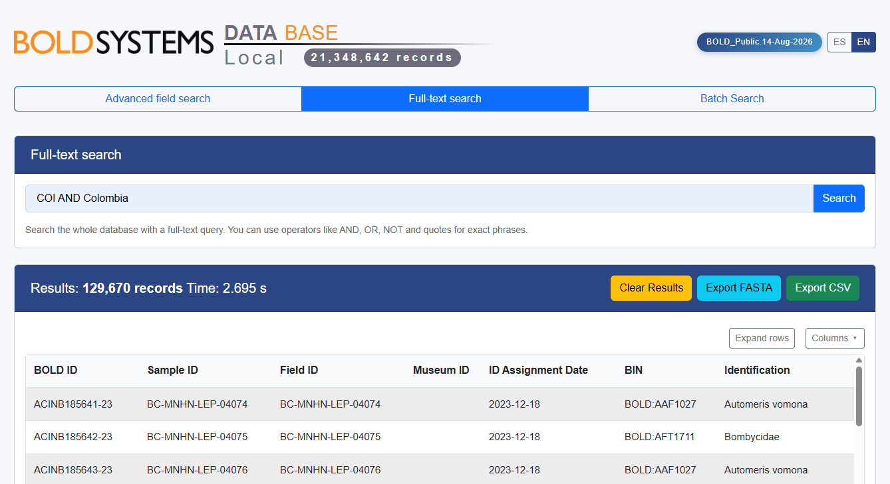
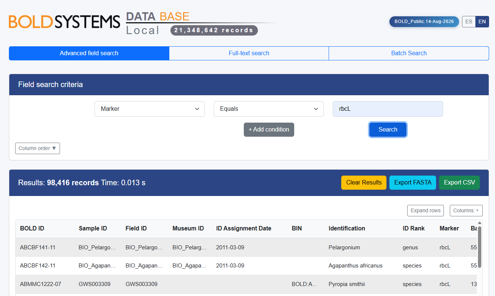
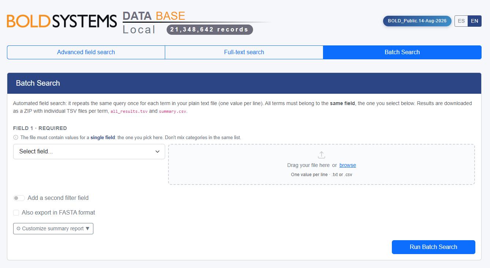

# BOLD-Local-DB

**Version: 1.1.1**

Desktop tool to build and browse a local, **offline** SQLite database from
[BOLD Systems](https://www.boldsystems.org/) (Barcode of Life Data System) TSV exports.

## What it does

Two programs, used in order:

1. **BOLD DB Creator** (`dev/bold_db_creator.py`) — filters the raw BOLD
   TSV/`tar.gz` export, loads it into SQLite, indexes the selected fields and
   builds full-text search.

   > **Note:** only records with a DNA sequence (`nuc` field) are kept —
   > records without a sequence are discarded during Step 1 (TSV filtering)
   > and never make it into the SQLite database.
   > That explains the difference in the number of records between the platform database and the local database.
2. **Web viewer** (`dev/frontend/server.py`) — local Flask web app to search,
   filter and export records (CSV / FASTA) from the database. Works fully
   offline once the database exists.

### Screenshots

| Full-text search | Advanced field search | Batch search |
|---|---|---|
|  |  |  |

## Requirements

- Windows, macOS or Linux
- Python 3 (dependencies auto-install on first run: PySide6, Flask, etc.)
- A [BOLD Systems](https://bench.boldsystems.org/) account, to download data packages
- ~80 GB of free disk space, for the downloaded package and the resulting database

## Quick start

1. Download a data package (`.tar.gz`) from
   [BOLD Systems — Data Packages](https://bench.boldsystems.org/index.php/datapackages/Latest).
2. **Generate your shortcuts** — a shortcut's target is an absolute path, so
   it has to be created for wherever *your* copy of this project ends up.
   Double-click, once:
   - Windows: `0_Generate_Shortcuts_Windows.bat`
   - Linux: `0_Generate_Shortcuts_Linux.sh`
   - macOS: `0_Generate_Shortcuts_macOS.command`
   Run it again any time you move the project to another drive, computer or
   user account, to regenerate broken shortcuts. (Or run
   `python dev/generate_shortcuts.py` from a terminal instead, on any OS.)
3. Build the database — double-click the **"1"** shortcut for your OS, at
   the project root:
   - Windows: `1_Create_DB.lnk`
   - macOS: `1_Create_DB.command`
   - Linux: `1_Create_DB.desktop`
4. Open the web viewer at `http://127.0.0.1:5001` — double-click the **"2"**
   shortcut, at the project root:
   - Windows: `2_Open_web_viewer_BOLD_DB.lnk`
   - macOS: `2_Open_web_viewer_BOLD_DB.command`
   - Linux: `2_Open_web_viewer_BOLD_DB.desktop`

None of the OS shortcuts are stored in the repository — they're
machine-specific, so `generate_shortcuts.py` creates them locally at the
project root for all three platforms (the macOS ones are copied from the
templates in `dev/macos_shortcuts/`). All of them just call the matching
script in `dev/` (`bold_db_creator.bat`/`.sh`, `launch_bold_db.bat`/`.sh`) —
use those directly instead if you'd rather run them from a terminal.

**First-run OS quirks:**
- **macOS**: Gatekeeper blocks scripts downloaded from the internet the
  first time — right-click a `.command` file → *Open* once to allow it.
  This applies to `0_Generate_Shortcuts_macOS.command` and to the
  generated `1_Create_DB.command` / `2_Open_web_viewer_BOLD_DB.command`.
- **Linux**: GNOME/KDE require marking a downloaded `.desktop` launcher as
  trusted — right-click it → *Allow Launching* (or *Trust*) once.
- If double-clicking doesn't work at all, run the `.sh`/`.command` script
  directly from a terminal instead.

## Project structure

```
BOLD_DB/
├── 0_Generate_Shortcuts_Windows.bat        # Windows: creates the 1/2 shortcuts
├── 0_Generate_Shortcuts_Linux.sh           # Linux: creates the 1/2 shortcuts
├── 0_Generate_Shortcuts_macOS.command      # macOS: creates the 1/2 shortcuts
├── 1_Create_DB.lnk / .command / .desktop            # generated shortcut, not versioned
├── 2_Open_web_viewer_BOLD_DB.lnk / .command / .desktop  # generated shortcut, not versioned
├── dev/
│   ├── bold_db_creator.py     # Steps 1-4: TSV filtering, SQLite load, indexing, FTS
│   ├── bold_db_creator.bat    # Windows launcher, called by 1_Create_DB.lnk
│   ├── bold_db_creator.sh     # macOS/Linux launcher, called by the "1" shortcuts
│   ├── launch_bold_db.bat     # Windows launcher, called by 2_Open_web_viewer_BOLD_DB.lnk
│   ├── launch_bold_db.sh      # macOS/Linux launcher, called by the "2" shortcuts
│   ├── generate_shortcuts.py  # creates/repairs the shortcuts for your OS
│   ├── macos_shortcuts/       # .command templates, copied to the project root
│   ├── icons/                 # icons used by the shortcuts and the GUI
│   ├── fields_config.json     # Fields kept from the BOLD TSV + which are indexed
│   ├── frontend/
│   │   ├── server.py          # Local web server (search / filter / export)
│   │   ├── static/
│   │   └── templates/
│   └── screenshots/
├── data/                      # raw / processed / exports (not versioned, auto-created)
└── guide/                     # user guide (ES/EN)
```

The generated database and raw/processed data are **not** part of this
repository (see `.gitignore`). Git doesn't track empty folders, so a fresh
clone won't include `data/` at all — `dev/bold_db_creator.py` recreates the
whole `data/raw`, `data/processed` and `data/exports/*` tree on every
startup, the same way it does for `app/`. No manual folder creation needed.

## Documentation

- [Guía de uso (ES)](guide/guia_de_uso.html)
- [User guide (EN)](guide/user_guide.html)

## License

[Polyform Noncommercial 1.0.0](LICENSE) — free to use, modify and redistribute
for any noncommercial purpose. Commercial use (selling it, offering it as a
paid service, etc.) is not permitted.
